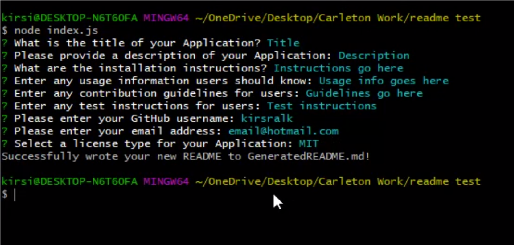
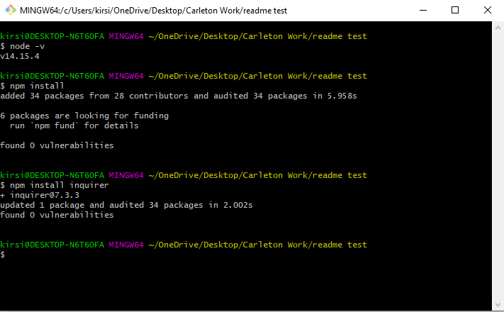

# README Generator

## Description 

README Generator is a CLI based app that allows users to quickly create a fully-formatted ReadME.md file ready for immediate use with any project.

Formatting of the generated ReadME file is optimized for Github using the [Mastering Markdown Guidelines](https://guides.github.com/features/mastering-markdown/).

Github repository includes "GeneratedREADME.md", a sample file created using this application.

* [Github Repository](https://github.com/kirsralk/README-Generator).
* [Tutorial on Screencastify](https://drive.google.com/file/d/1Zh9wdipebyt72QSPLXgv7CfgAmUnX3-B/view?usp=sharing).
* .

### User Story

```
AS A developer
I WANT a README generator
SO THAT I can quickly create a professional README for a new project
```

## Installation

Note: This application runs on a Command Line Interface only (not in a browser).
   * 

### Step 1: Install Node

Ensnure you have the Node.js runtime environment installed on your machine.  Helpful instructions to install Node are available [here](https://coding-boot-camp.github.io/full-stack/nodejs/how-to-install-nodejs).

You can confirm if Node is properly installed on your machine by running the command "node -v" in your terminal, which will return the Node verison number you have installed. 

This project was created using Node v.14.15.4.

### Step 2: Install the Default NPM Package

Install the NPM CLI modules package by running the command "npm install" in your terminal.

By default, this will install all modules listed as dependencies in a new subfolder called node_modules and the package.json file.

What are the steps required to install your project? Provide a step-by-step description of how to get the development environment running.  

### Step 3: Install Inquirer

Install the additional NPM package Inquirer by running the command "npm install inquirer" in your terminal.

This will install additional node_module files and package-lock.json.

You are now ready to run the REAME Generator application!


## Usage 

* Invoke the application by running the "index.js" file within the Node environment (run the command "node index.js" in your terminal).

* Answer the prompts with text inputs or by selecting items from the list provided
   * 

* Once all of the prompts have been answered, index.js will execute the generateREADME() function thats creates a file called "GeneratedREADME.md".  This is your new, fully formatted README!
   * Look for the response "Successfully wrote your new README to GeneratedREADME.md" in your terminal.

For a video walkthrough of the app, check out the [README Generator Tutorial](https://drive.google.com/file/d/1Zh9wdipebyt72QSPLXgv7CfgAmUnX3-B/view?usp=sharing).


## Credits

Created by Kirsi: https://github.com/kirsralk/


## License

[](https://opensource.org/licenses/MIT)